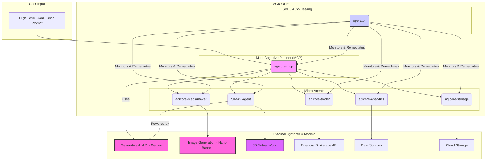

### Flow Description

1.  **User Input:** The process begins with a high-level goal or prompt provided by the user.

2.  **MCP (Multi-Cognitive Planner):** The `agicore-mcp` receives the user's goal. Powered by the **Gemini** language model, it breaks down the goal into a sequence of tasks (a plan).

3.  **Task Delegation:** The `agicore-mcp` delegates these tasks to the appropriate specialized micro-agents:
    *   **agicore-trader:** For financial tasks, it interacts with a **Brokerage API**.
    *   **agicore-mediamaker:** For media generation ("Génération Automatisée"), it uses the **Nano Banana** (Gemini 2.5 Flash Image) model to create images.
    *   **agicore-analytics:** For data analysis, it pulls data from various **Data Sources**.
    *   **agicore-storage:** For storage-related tasks, it interacts with **Cloud Storage**.
    *   **SIMA2 Agent:** For tasks within a simulated 3D environment, it interacts with a **3D Virtual World**. The SIMA2 agent is itself powered by **Gemini**.

4.  **Auto-Healing:** The `operator` agent continuously monitors the health of all other AGICORE services. If an agent becomes unhealthy, the `operator` automatically takes corrective action, such as restarting the service.

This unified schema illustrates how AGICORE, Gemini, SIMA2, and Nano Banana work together to form a comprehensive, autonomous, and resilient multi-agent system.
