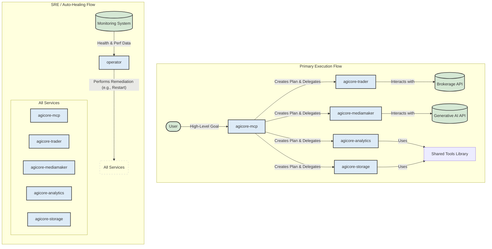

# AGIcore-v2: A Multi-Agent System for Autonomous Operations

AGIcore-v2 is a distributed, multi-agent system designed for autonomous task planning, execution, and self-healing. It follows a microservices architecture, where each agent is an independent, containerized service that can be deployed and scaled individually.

This system is built to be deployed on Google Cloud Run, leveraging other cloud-native services like Artifact Registry for container storage and IAM for secure operations.

## Core Concepts

- **Multi-Cognitive Planner (MCP)**: The "brain" of the system. It receives high-level goals and creates a sequence of steps (a "plan") to achieve them. It then orchestrates the execution of this plan by delegating tasks to other agents.
- **Micro-Agents**: Specialized services that perform specific tasks. Examples include `agicore-trader` (for financial operations), `agicore-mediamaker` (for content generation), and `agicore-analytics` (for data processing).
- **Operator**: The SRE (Site Reliability Engineering) agent. It monitors the health of all other agents, diagnoses problems, and performs automated remediation, such as restarting an unhealthy service. This provides an auto-healing capability to the system.
- **Tools**: A shared library of functions that agents can use to perform common actions, such as making API calls, analyzing data, or interacting with storage.

## Target Architecture

The system is designed as a set of communicating microservices, ready for deployment on a serverless container platform like Google Cloud Run.



## Project Structure

```
agicore-v2/
├── .github/workflows/      # GitHub Actions CI/CD pipeline
│   └── main-ci-cd.yml
├── services/               # Source code for all micro-agent services
│   ├── agicore-mcp/        # Multi-Cognitive Planner
│   ├── operator/           # Auto-healing SRE agent
│   ├── agicore-trader/
│   ├── agicore-mediamaker/
│   ├── agicore-analytics/
│   └── agicore-storage/
├── scripts/                # DevOps and utility scripts
│   ├── build_images.sh     # Builds all Docker images
│   ├── deploy.sh           # Deploys all services to Cloud Run
│   └── local_dev.sh        # Placeholder for local development setup
├── tests/                  # Automated tests
│   ├── unit/
│   └── integration/
├── tools/                  # Shared tools and utilities
├── pytest.ini              # Pytest configuration
├── run_all_tests.sh        # Master test runner script
└── README.md               # This file
```

## Getting Started

### Prerequisites
- Docker
- Google Cloud SDK (`gcloud`)
- Python 3.9+

### Local Development
While a full local environment is best managed with Docker Compose, you can run individual services directly.

1.  **Navigate to a service directory:**
    ```bash
    cd services/agicore-mcp
    ```

2.  **Install dependencies:**
    ```bash
    pip install -r requirements.txt
    ```

3.  **Run the service:**
    ```bash
    uvicorn main:app --reload --port 8001
    ```
The service will be available at `http://127.0.0.1:8001`.

### Running Tests
To run the entire test suite:
```bash
./run_all_tests.sh
```

## Deployment

Deployment is handled automatically by the CI/CD pipeline defined in `.github/workflows/main-ci-cd.yml`.

### Automated CI/CD Pipeline
The pipeline automates the **Test -> Build -> Deploy** process. On every push to the `main` branch, it will:
1.  Detect which services under the `services/` directory have changed.
2.  Run the complete automated test suite.
3.  If tests pass, it will build a new Docker image for each changed service and push it to Google Artifact Registry.
4.  Deploy the new image to the corresponding Google Cloud Run service.
5.  Perform a smoke test to ensure the service is responsive.

The pipeline is fully dynamic. Any new service added to the `services/` directory with a `Dockerfile` will be automatically included in this process.

### Configuration
To enable the CI/CD pipeline, you must configure the following secrets and variables in your GitHub repository's **Settings > Secrets and variables > Actions**:

**Repository Secrets:**
-   `GCP_SA_KEY`: The JSON key for your Google Cloud service account. The service account requires roles like `Artifact Registry Writer` and `Cloud Run Admin`.

**Repository Variables:**
-   `GCP_PROJECT_ID`: Your Google Cloud project ID.
-   `GCP_REGION`: The region for your services (e.g., `us-central1`).
-   `GAR_REPOSITORY`: The name of your Google Artifact Registry repository (e.g., `agicore-repo`).
-   `GCP_RUN_SERVICE_ACCOUNT`: The email of the runtime service account that Cloud Run services will use.
